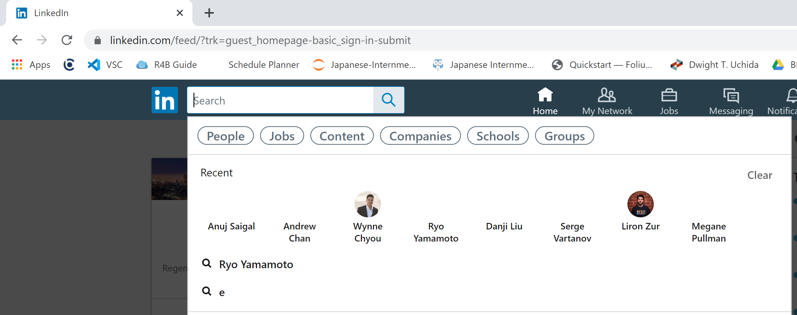
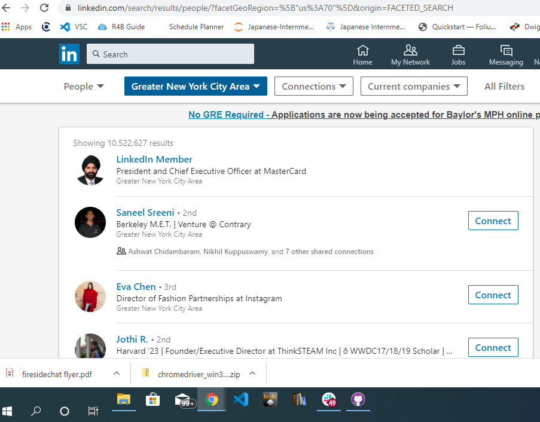

# Scrape-filtered-list-of-people
 Scrape lists of profiles from filtered search lists on linkedin's 2020 webpage.
 Lots of comments are made so that if people want to learn how to make a similar
 scraper, it's easy to understand. Also, the code is written so that each command
 is simple so that the people can see how a crawler works. This crawler was made
 to be very simple and easy to use.
 
 There's some extra code commented out using """ since it got complicated and realized
 I didn't need this part of the code. However, I included it in case someone wants to
 mess around with the code.
 
 Since linkedin occasionally updates it's website and changes tags, this crawler
 may not work at some point. If the crawler doesn't work, please message me.
 
### 1) go to https://www.linkedin.com/ and log in.

### 2) go to the search bar and click people, like this:

### 3) search using filters so that your output looks like this:

### 4) copy the link of that web page

### 5) After downloading/cloning this repo, edit config.txt and enter the following, replacing the text in each file:
1) username or email 
2)linkedin password 
3)the link you just copied

### 6) Run the python file. Your input.csv file should have all of the inputs. congrats!
