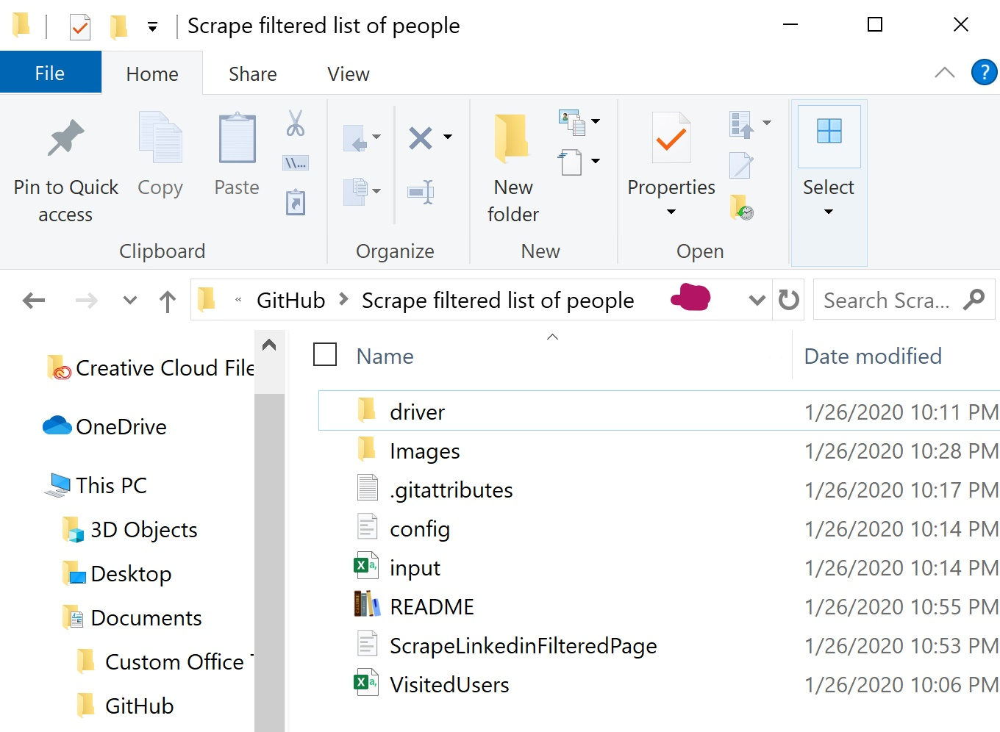

# Scrape-filtered-list-of-people
 Scrape lists of profiles from filtered search lists on linkedin's 2020 webpage.
 Lots of comments are made so that if people want to learn how to make a similar
 scraper, it's easy to understand. Also, the code is written so that each command
 is simple so that the people can see how a crawler works. This crawler was made
 to be very simple and easy to use.
 
 There's some extra code commented out using """ since it got complicated and realized
 I didn't need this part of the code. However, I included it in case someone wants to
 mess around with the code.
 
 Since linkedin occasionally updates it's website and changes tags, this crawler
 may not work at some point. If the crawler doesn't work, please message me.
 
### 1) go to https://www.linkedin.com/ and log in.

### 2) go to the search bar and click people, like this:

### 3) search using filters so that your output looks like this:

### 4) copy the link of that web page

### 5) After downloading/cloning this repo, edit config.txt and enter the following, replacing the text in each file:
1) username or email 
2)linkedin password 
3)the link you just copied

### 6) open the ScrapeLinkedinFilteredPage.py folder. search "replace with location" and replace the source file paths to your own source file paths. 
To do this, first navigate to where the folder is. Right click on where the red dot is. select copy path. then paste into each of the strings that you need to replace. for example, if I copied "C:\Users\Kentaro Vadney's XPS\Desktop\Scrape filtered list of people"
Then I paste that, replacing each string, and switch all of the '\'s to a '/' , then add the name of the file after a backslash at the end like: '/config.csv' for config,  '/input.csv' for input, and '/chromedriver.exe' for chrome driver (so the string looks like this in my case: "C:/Users/Kentaro Vadney's XPS/Desktop/Scrape Linkedin/Chrome Driver/chromedriver.exe"). I'm sorry for the inconvenience :(

### 7) Run the python file. The program pauses a while so that Linkedin doesn't notice that you're running a bot on your account. We don't want to get ourselves banned or slowed! Your input.csv file should have all of the inputs. congrats!
